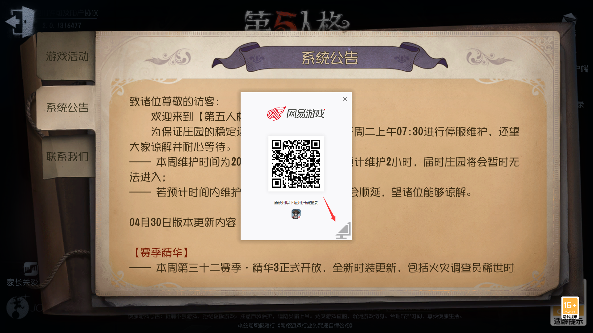

# IdentityV-login-helper(绕过注册时间限制-一键法)


项目仓库：[click](https://github.com/Alexander-Porter/idv-login)
QQ群：[click](https://www.bilibili.com/opus/920131433914171416)
视频教程（已过时）：[click](https://www.bilibili.com/video/BV1qM4m1Q7i8)

## 1. 使用方式

### 特别注意
1. 在目前版本中，开去本工具后将无法进行扫码登录，如果您是渠道服账号或官服可扫码账户直接登录的账户，请**暂时**先不要使用本工具，该问题将在下一个版本中修复。
2. 如果遇到 ``pid=4`` 的进程占用了443端口，请尝试使用``netsh http show servicestate``命令排查使用系统服务占用443端口的程序，该问题将在下一个版本中修复。

### 使用预编译版本
1. 从本仓库的``release``页下载最新版本的可执行文件(*.exe)
- **注:如果你使用的是`Windows7`，请下载带有`Py3.7`后缀的版本；如果你使用的是`Windows8`及以上版本，两者均可，推荐下载带有`Py3.12`后缀的版本**)
- 下载完成后，**强烈建议**校验其``sha256``是否与 ``release``中``checksum.txt``的值相同。
    如果``sha256``不同，那么您下载的文件是不安全的，可能存在盗号风险，请检查您的网络环境并重新在**官方仓库**下载文件。
2. 您可以使用 ``Windows Powershell`` 的 ``Get-FileHash`` 命令来获取文件的``sha256``值，例如，计算v5.0.0-stable版本的`sha256`可以使用以下命令：
    ```bash
    PS D:\> Get-FileHash idv-login-v5.0.0-stable.exe

    Algorithm       Hash
    ---------       ----
    SHA256          <这里会显示HASH值>
    ```
3. 直接右键**以管理员身份运行**下载的可执行文件，例如``idv-login-v5.0.0-stable.exe``，等观察到脚本提示``可以开启游戏``时，保持终端窗口**打开**，然后您可以打开游戏。    
    
4. 打开游戏后，点击登录框**右下角的"电脑"图标**（如下图所示），即可使用账号密码登录，以绕过注册时间限制。



5. 当你成功登录进入游戏大厅后，你可以在本程序界面中使用``Ctrl+C``关闭本程序。

### 手动构建（Optional）

* 在 Python 官网下载 Python [Python.org](https://www.python.org/downloads/release/python-3123/)
* 例：64 位电脑 [Windows installer (64-bit)](https://www.python.org/ftp/python/3.12.3/python-3.12.3-amd64.exe)
* 安装Python时要**使用管理员权限**，自定义(Custom)安装，**添加到Path**、**为所有用户安装**和**pip**。
* 由于新版本的Python **不支持** Windows7，如需在Windows7上构建本程序，可能需要借助**Anaconda**之类的软件安装支持Windows7的python（如 python 3.8）进行构建，具体教程请自行百度。
* 下载[代码](https://github.com/Alexander-Porter/idv-login/archive/refs/heads/one-key.zip)到本地，解压
* 进入解压后的目录，shift+鼠标右键，选择打开Powershell或终端
* 输入以下代码并回车
```bash
pip install -r requirements.txt
pyinstaller -F src/main.py -n idv-login-v10beta.exe -i assets/icon.ico --version-file assets/version.txt --uac-admin
```
* dist文件夹中的`idv-login-v10beta.exe`就是成品

### 如果程序意外退出导致开游戏后无法登录
* 在文件资源管理器里输入`%windir%\System32\drivers\etc`并回车，删除`hosts`文件，即可解除工具对网易登录的劫持。
## 2. 开源协议
本仓库使用 ``GNU General Public License 3`` 进行开源，请使用/分发本仓库的软件或源代码或衍生产品时请遵守该开源协议，并保留原始项目地址。**需要特别注意的是，根据``GPLv3``许可证的要求，如果你使用了本仓库的代码进行二次开发，那么您的代码也必须使用`GPLv3`协议开源。**

## 3. Bug 反馈
如果您在使用过程中遇到了 ``Bug``, 可以在本仓库提交 `issue` 或者加入QQ群进行反馈。